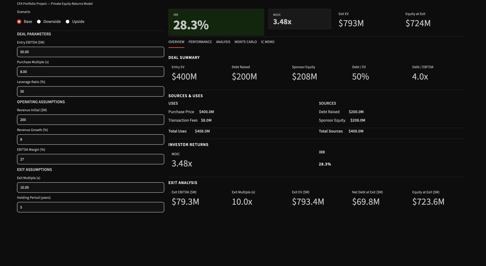

# LBO Simulation Engine

Built a full Private Equity leveraged buyout (LBO) engine in Python that
replicates how investors evaluate deals — from entry assumptions to exit returns.

The model projects financial performance, simulates debt repayment, and outputs
key investment metrics (IRR, MOIC, equity value) across scenarios. Monte Carlo
simulation quantifies downside risk. An interactive dashboard replicates
real-world PE investment committee analysis.



---

## What this demonstrates
- Ability to model a full PE deal from scratch
- Understanding of capital structure, leverage, and return drivers
- Ability to translate financial models into interactive decision tools
- Clean Python architecture — modular, separated by concern, documented

---

## Features

| Financial Engine | Interactive Dashboard |
|---|---|
| Deal model — Sources & Uses, sponsor equity | KPI banner — IRR and MOIC always visible |
| Operating model — FCF projection | Scenario toggle — Base / Downside / Upside |
| Debt schedule — mandatory amortization + cash sweep | Value Creation Bridge waterfall chart |
| Returns — MOIC and IRR | Sensitivity table — IRR vs leverage × exit multiple |
| Covenant testing — leverage and coverage ratios | Monte Carlo histogram with hurdle line |
| Scenario analysis — Downside / Base / Upside | IC Memo generator — auto investment recommendation |
| Monte Carlo simulation — 500 runs | STRONG BUY / BUY / CONDITIONAL BUY / PASS verdict |

---

## Quick Start

```bash
git clone https://github.com/FrancoisRost1/lbo-engine-version1.git
cd lbo-engine-version1
pip install -r requirements.txt
streamlit run app/streamlit_app.py
```

---

## Financial Model

### Deal Model
```
Entry EV        = Entry EBITDA × Purchase Multiple
Fees            = Entry EV × Fee %
Total Uses      = Entry EV + Fees
Debt Raised     = Entry EV × Leverage Ratio
Sponsor Equity  = Total Uses − Debt Raised
```

### Operating Model
```
Revenue(t)  = Revenue(t-1) × (1 + Revenue Growth)
EBITDA(t)   = Revenue(t) × EBITDA Margin
Capex(t)    = Revenue(t) × Capex %
Taxes(t)    = EBITDA(t) × Tax Rate
ΔNWC(t)     = Revenue(t) × NWC %
FCF(t)      = EBITDA(t) − Capex(t) − Taxes(t) − ΔNWC(t)
```

### Debt Schedule
```
Interest(t)            = Opening Debt(t) × Interest Rate
Mandatory Repayment(t) = Opening Debt(t) × Amortization Rate
Cash after Debt(t)     = FCF(t) − Interest(t) − Mandatory Repayment(t)
Optional Repayment(t)  = max(0, Cash after Debt(t)) × Cash Sweep
Ending Debt(t)         = Opening Debt(t) − Mandatory − Optional Repayment(t)
```

### Returns
```
Exit EV        = Exit EBITDA × Exit Multiple
Equity at Exit = Exit EV − Ending Debt (final year)
MOIC           = Equity at Exit / Sponsor Equity
IRR            = numpy_financial.irr([−Sponsor Equity, 0, …, Equity at Exit])
```

### Simplifying Assumptions
- Taxes calculated on EBITDA (not EBT)
- Interest on opening debt balance (not average)
- No minimum cash balance
- No working capital seasonality
- No refinancing at maturity
- Exit at end of fiscal year
- Single debt tranche
- Transaction fees funded by equity

---

## Tech Stack

| Library | Purpose |
|---|---|
| Python 3 | Core engine |
| Streamlit | Interactive web dashboard |
| Plotly | Charts — waterfall, histogram, bar |
| Pandas | DataFrames, scenario tables |
| numpy-financial | IRR calculation |
| PyYAML | Config file parsing |

---

## Project Structure

```
lbo-engine/
├── main.py                  # Orchestrator — runs full pipeline, prints results
├── config.yaml              # All base case assumptions
│
├── lbo/
│   ├── deal_model.py        # Entry EV, Sources & Uses, sponsor equity
│   ├── operating_model.py   # Revenue, EBITDA, FCF projection
│   ├── debt_schedule.py     # Interest, amortization, cash sweep
│   ├── returns.py           # Exit EV, MOIC, IRR
│   ├── covenants.py         # Leverage & coverage breach detection
│   ├── scenarios.py         # Downside / Base / Upside
│   └── monte_carlo.py       # 500+ simulations, IRR distribution
│
└── app/
    └── streamlit_app.py     # Interactive dashboard — Bloomberg dark mode, 5 tabs
```
